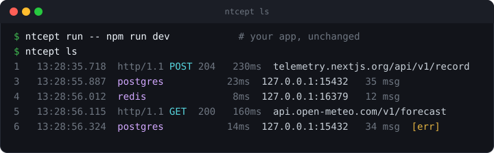
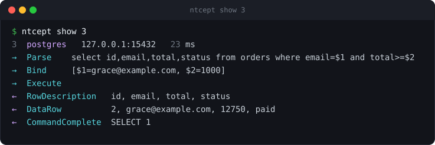
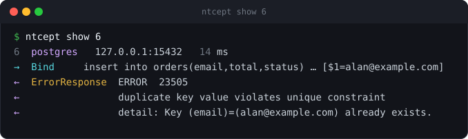
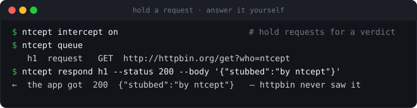
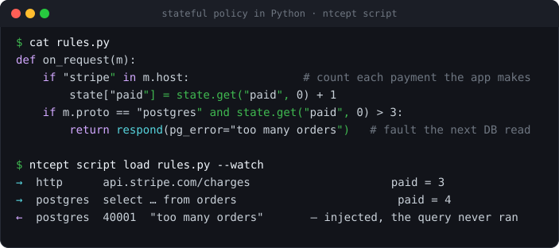
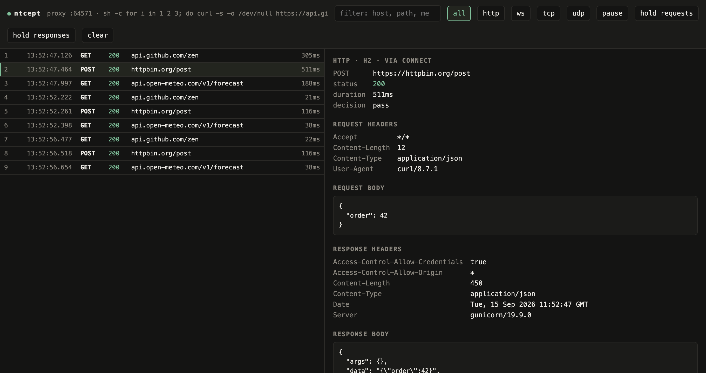

# ntcept

**A network debugger for coding agents.** See and control every request and query a program
makes — no code changes, no SDK, no proxy config, whatever language it's written in.

```bash
ntcept run -- npm run dev
ntcept ls
```

<p align="center"></p>

The network is an agent's blind spot. It can read stdout, add a print statement, even drive a
debugger — but none of that shows the request that actually left the machine, the SQL that actually
ran and with which parameters, or the error the database actually returned. ntcept turns "what did
this program do on the network?" into structured output: run anything under `ntcept`, and every
connection it opens — an HTTPS call to a third-party API, a query to Postgres, a call to Redis — is
captured, decoded, and queryable, tied to the process that made it. And the same path that watches
traffic can change it: drop a request, inject a fault, rewrite a response — by hand, or from a few
lines of **Python that decide per request, with memory of everything that came before** (*"fault 5%
of Postgres selects after a Stripe call over $200"*). It's also a sharp inspector for a person
(`ntcept ui`).

## Built for agents

This is the reason ntcept exists. Everything is a CLI that emits JSON, so an agent can drive it
and reason over the results:

```bash
ntcept run -- pytest              # run the thing; capture happens around it
ntcept ls --status 500 --json     # only the failures, as JSON
ntcept ls --grep 'order_id' --json | jq '.flows[].url'
ntcept show 12 --json             # one exchange in full, decoded
ntcept wait --path /checkout --status 200 --timeout 30s   # synchronise, don't sleep
```

Three things make it fit an agent rather than a human staring at a GUI:

- **Structured, filterable output.** One response body can be larger than the whole context
  budget. `ntcept ls --grep` and `--status`/`--path`/`--host` filter *server-side*, so only what
  matters crosses into the model.
- **Synchronisation without polling.** `ntcept wait` blocks until a matching flow completes, so an
  agent can act the moment a request lands instead of sleeping and hoping.
- **Fault injection and rewriting, without a mock.** The hard half of testing is the unhappy path:
  the 503 from the payment API, the timeout that trips a retry, the malformed response that should
  be handled and isn't. ntcept lets an agent produce those on demand against the *real* code path —
  drop a request, stall it, rewrite its body or headers, or answer it with a canned response — with
  no mock server, no fault-injection library, and no edit to the code under test (see
  [Modifying traffic](#modifying-traffic)).
- **Policy as code, hot-reloaded.** When the rule is conditional and stateful — *"fault 5% of
  Postgres selects after a Stripe call over $200, until a Redis key clears"* — an agent writes it as
  a few lines of Python instead of a wall of flags. ntcept runs that script against every request,
  with in-memory state across the whole run, and reloads it the moment the file changes (see
  [Programmable interception](#programmable-interception)).

## Why not a proxy or a sniffer

The tools an agent might otherwise reach for each fall short:

- **A proxy** (mitmproxy, Charles) needs the app to cooperate — a proxy setting and a trusted CA
  you configure. Anything that ignores `HTTPS_PROXY` (Node's `http`/`https`, a Go binary, a bare
  `socket.connect`) slips past it, and a proxy only speaks HTTP.
- **A packet sniffer** (Wireshark, `tcpdump`) sees everything and understands little: TLS is
  opaque, it can't scope to one process, and it can't tell you *which HTTP request* caused *which
  SQL query*.

ntcept intercepts below the socket API of one process tree, so routing works whatever the language
or HTTP client. It decodes HTTP *and* databases with one engine, so the outbound API call and the
query it triggered land in the same list, in order. And it reads TLS by pointing the program at a
CA it manages for that run — not by touching your system trust store (see
[How it works](#how-it-works)).

## What it decodes

It reads the protocol off the wire, not off the port number — so a database on whatever port your
compose file mapped is still recognised as a database.

<p align="center"></p>

The line that matters there is **`Bind`**. Every driver and ORM uses the extended query protocol:
the SQL travels once with placeholders (`where email = $1`), and the *values* travel separately.
Most tools show the statement and lose the values — so you know a query ran, but not which
customer it ran for. ntcept shows both.

Errors come back as what the server actually said, not a blob of bytes:

<p align="center"></p>

| | |
|---|---|
| **HTTP** | HTTP/1.1, HTTP/2, h2c, WebSocket frames, Server-Sent Events, gzip / deflate / brotli bodies |
| **Databases** | PostgreSQL (incl. bound parameters and typed errors), MySQL (commands, prepared statements, errors), Redis (RESP2 **and** RESP3), MongoDB (OP_MSG commands) |
| **Other** | DNS queries, and a readable fallback for any other TCP stream |

Credentials are masked on the way into the capture buffer — the real value still reaches the
service, only the stored copy is a stable fingerprint (see [Credentials](#credentials)).

## Modifying traffic

Watching is half of it. Because every exchange is terminated *inside* ntcept, it can also be
changed on the way through — and this is where it earns its place in a test loop. The code most
likely to be wrong is the code that runs when the network misbehaves, and that code is the hardest
to trigger on purpose: you can't make Stripe return a 503, make DNS flap, or make Postgres time out
mid-transaction to order. ntcept makes those first-class actions. An agent (or a person) can:

- **drop** a request to see how a timeout or a dead dependency is handled;
- **respond** locally with a 500, a rate-limit body, or a truncated payload — the request never
  reaches the real service;
- **edit** a request or response in flight — flip a header, corrupt a field, point it at staging —
  and let the changed version go on to the upstream;
- **hold** an exchange to inspect and release it by hand, to reproduce a race.

None of this touches the program under test: no mock, no feature flag, no `if (TEST)` branch, no
recorded-cassette library. The application makes its real call and meets the reality you chose.

Nothing is held until you ask, so an unattended run never stalls. Turn holding on and each
exchange waits for a verdict — forward it, drop it, rewrite it, or answer it yourself:

<p align="center"></p>

```bash
ntcept intercept on                 # hold requests; add --responses to hold the other direction
ntcept queue                        # what's waiting on you
ntcept forward h1                   # send it on untouched
ntcept drop h1                      # kill it, as the network would
ntcept respond h1 --status 503 --body '{"error":"nope"}'      # answer locally, never upstream
ntcept edit h1 --set-header 'X-Debug: 1' --url https://staging.example.com/v2/orders
```

`edit` reaches the upstream changed; `respond` keeps the request from ever leaving the machine.
The inspector does the same thing with a form.

**Databases are held the same way, one message at a time.** Because ntcept frames the wire protocol
rather than treating a database connection as an opaque byte stream, a query can be paused,
dropped, rewritten or answered exactly like an HTTP request — the same reason the unhappy path is
hard to trigger applies double to a database, where you cannot make Postgres return a serialization
failure or a dead connection to order:

```bash
ntcept intercept on                 # holds queries; add --responses to hold results too
ntcept queue                        # e.g.  h1  postgres request  held 2s
                                    #         Query select * from orders where id = $1
ntcept drop h1                      # tear the connection down, as the network would
ntcept respond h1 --pg-error '40001: could not serialize access'   # answer locally; never runs
ntcept edit h1 --set-raw @rewritten.bin                            # rewrite the message on the wire
```

`respond` synthesises a real protocol reply (for Postgres, an `ErrorResponse` and the
`ReadyForQuery` that returns the driver to a usable state), so the application's own error handling
runs against an error the server never sent. Holding, dropping and editing work for PostgreSQL,
MySQL, Redis and MongoDB; local `respond` is Postgres today. Answer a request on the first message
of the query — the connection stays healthy afterwards.

## Programmable interception

Flags answer one request at a time. Real fault scenarios are *conditional and stateful* — they
depend on what happened earlier, on this connection or a different one, across HTTP **and** the
database. So ntcept lets you hand it a **Python script** that decides, per message, what to do:
forward, delay, drop, rewrite, answer locally, hand to the manual queue, or redact what gets stored.
It runs in a `python3` worker ntcept manages, keeps arbitrary state in memory for the whole run, and
**reloads the instant you save the file** — no restart, no lost state.

<p align="center"></p>

```python
# rules.py — one file; ntcept calls on_request(m) / on_response(m) for every message.
import random
state = {}                                   # persists across every request, and across reloads

def on_request(m):
    # An outbound call to Stripe over $200 arms the policy (cross-flow state).
    if m.proto == "http" and "stripe" in m.host and (m.json or {}).get("amount", 0) > 20000:
        state["armed"] = True
    # A Redis GET of "reset" disarms it.
    if m.proto == "redis" and m.cmd == "GET" and m.args[:1] == ["reset"]:
        state["armed"] = False
    # While armed, fault 5% of Postgres SELECTs and slow the rest.
    if m.proto == "postgres" and m.is_select and state.get("armed"):
        return respond(pg_error="40001: injected") if random.random() < 0.05 else delay(800)

def on_response(m):
    # Dynamic redaction: scrub a column from the stored copy; the app still gets the real row.
    if m.proto == "postgres" and m.row:
        return record(redact=[m.row[1]])
```

```bash
ntcept run --script rules.py --watch -- npm run dev   # load at start, reload on save
cat rules.py | ntcept script load -                   # or pipe code straight in
ntcept script reload      # re-read, keep state        ntcept script reset   # re-read, wipe state
ntcept script status      # calls, verdict counts      ntcept script logs    # per-request output
```

- **State that spans the run.** `state` is one dict that survives every request and every reload
  (only `reset` clears it); `m.ctx` is a per-exchange dict shared between a request and its response.
- **Every lever the manual queue has** — `drop()`, `delay(ms)`, `edit(sql=…, row=[…], body=…)`,
  `respond(pg_error=…)`, `hold()` (defer to a person), plus `record(redact=[…])` to scrub the stored
  copy while the real bytes go on the wire. Any verdict can carry a delay.
- **Written for agents.** `log(…)` lines are attached to the exact request that produced them —
  `ntcept show <id>` replays them, and `ntcept script logs` tags every line by flow id. A rule that
  throws or hangs **fails open**: the traffic passes untouched and the error surfaces in `status`.
- Scripting needs `python3` on PATH (`ntcept doctor` checks); without it, the tool says so rather
  than pretending. While a script is loaded it is in control, and the inspector disables the manual
  hold toggles to match.

## Quickstart

```bash
go build -o ntcept ./cmd/ntcept
sudo ntcept install          # macOS only, once per machine — see below. Linux needs nothing.

ntcept run -- <your command> # launch anything; its traffic is captured
ntcept ls                    # list flows
ntcept show 3                # one flow in full, decoded
ntcept ui                    # open the inspector in a browser
```

Everything after `--` runs as it would have — same shell, same files, same environment plus a few
variables scoped to that one process.

There's a runnable example under [`examples/nextjs`](examples/nextjs): a Next.js app plus a
Postgres and a Redis in Docker (on deliberately non-standard ports, to prove detection is by
content). `docker compose up -d`, then `ntcept run -- npm run dev`.

## The inspector

`ntcept ui` opens a live view of the same capture buffer: flows stream in as they complete, you
filter and search across headers and bodies, and open any flow to see it decoded — HTTP or
database. With holding armed, a paused exchange is editable in place before you let it go.

<p align="center"></p>

The control plane is loopback-only — the capture buffer holds credentials for every service the
app talked to, so it never listens anywhere but `127.0.0.1`.

## How it works

One interception engine, two ways of getting a process's packets into it.

```
        Linux                             macOS
  network namespace + TUN           utun + pf redirect
  scoped to the process tree        scoped to the command's group
  no privileges required            one-time `sudo ntcept install`
            └────────────────┬────────────────┘
                  userspace TCP/IP stack  (gVisor netstack)
                              │
       TLS termination · HTTP/1.1 · HTTP/2 · WebSocket · raw TCP · UDP/DNS
                              │
             protocol decoders → bounded in-memory ring, redacted at capture
```

Every connection the supervised process opens is terminated *inside* ntcept and re-originated from
ntcept's own side. Above the device it's one shared engine, so both platforms behave the same and
a bare `socket.connect()` is intercepted exactly like `fetch`.

**Reading TLS needs a CA — a scoped one.** ntcept generates a CA once and keeps it in `~/.ntcept`.
It is never added to your system trust store; instead the program being run is pointed at that CA
for the one run, through trust environment variables scoped to that process. A runtime that ignores
those and pins its own roots stays an opaque passthrough (ntcept records it rather than breaking
it), and `ntcept doctor` measures which runtimes on your machine actually trust it.

**What changes on the machine — honestly:**

- **Linux:** nothing persistent. The child runs in its own network namespace; the host is
  untouched, and no privileges are needed where unprivileged user namespaces are enabled.
- **macOS:** `sudo ntcept install` places a root-owned helper and a narrowly scoped sudoers grant
  — that *is* a change to your machine, and `sudo ntcept uninstall` reverses it. After that, each
  run loads a pf anchor and a loopback alias that are removed when it exits.

**localhost is captured too**, including traffic between two local services and calls to a database
you started yourself. Other processes using the same local service are carried straight through —
never captured, listed, or held. Multiple `ntcept run`s coexist: each captures only its own
traffic, and killing one doesn't disturb another.

**There is one attach, and no silent fallback.** ntcept intercepts below the socket API or not at
all: a machine that can't (macOS before `sudo ntcept install`, a container with no user namespaces
or `/dev/net/tun`) is told why and refused, rather than quietly downgraded to a proxy that would
miss most of the traffic and leave you reading an empty capture as if the program made no requests.
`ntcept doctor` reports whether this machine can tunnel.

## Credentials

Credential headers (`Authorization`, `Cookie`, `X-Api-Key`, …) and secret-looking JSON fields are
replaced by `«name/fingerprint»` on the way into the capture buffer. The real value still reaches
the upstream service — only the stored copy is masked, and the forwarding path retains nothing.

The fingerprint is stable, so "did these two requests use the same token?" stays answerable
without the token being readable. Your own request bodies and payloads are left alone.

## Performance

Every benchmark ships with the un-intercepted baseline beside it, because a proxy's throughput
number means nothing alone:

```bash
go test ./internal/proxy ./internal/tunnel ./internal/redact -run '^$' -bench . -benchmem
```

On an M3 Pro, a 1 MB response moves at ~1980 MB/s direct and ~700 MB/s through ntcept; a small
request on a warm connection goes from ~82 µs to ~160 µs. The userspace TCP/IP stack is not the
expensive part — a megabyte through it costs about what the same megabyte costs through the proxy
port with no stack at all.

## Tests

```bash
go test -race ./...        # everything, including the interception engine
go test -short ./...       # skips the end-to-end tests, which build the binary
```

The engine is tested without a TUN, a namespace, or root: a second userspace TCP/IP stack stands
in for the supervised process, so a real `connect()` produces real packets and everything above
the device is exercised. The end-to-end tests build the binary and run a real command under it on
every attach the machine supports.

## Building

```bash
go build -o ntcept ./cmd/ntcept       # untagged builds identify themselves by commit sha
ntcept version                        # e.g. "ntcept 1a2b3c4d5e6f (go1.26)"
go build -ldflags "-X main.Version=v0.1.0" -o ntcept ./cmd/ntcept   # stamp a release version
```

## License

Proprietary — all rights reserved. Not open source. See [LICENSE](LICENSE). Viewing this
repository does not grant a license to use it.
